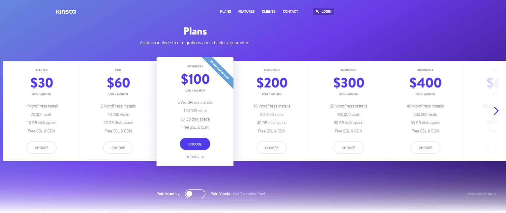

---

title: How to Increase SaaS Conversion Rate Using Cold-War Science and UX Minimalism
date: "2020-07-13T10:12:03.284Z"
description: "SaaS conversion rate optimization is a difficult topic made simpler through UX minimalism. In this case study, I analyze 97 of the top SaaS companies for trends to help you convert the right customers for your business."
bulletDescription: "<ul><li>The advantages of UX minimialism</li><li>How to apply scientific design principles</li><li>Software website trends from top companies</li></ul>"
shortDescription: "In this case study, you'll learn about UX minimalism and SaaS industry standards to convert the right customers and increase MRR."
topic: "SaaS conversion rate optimization"
twitterTags: ["SaaSCRO", "SaaSUX", "SaaSdesign"]
featuredImage: ./SaaS-CRO-Hero.svg
author: "Jake Hatfield"
postID: "1"
path: "/blog/how-to-increase-saas-conversion-rate"
readTime: "19"
---<!-- readTime = word count / 265 -->

Increasing the conversion rate of a SaaS is tricky because it's unbelievably easy to tell yourself the lie that all conversions are created equal.

As if you're living in a parallel universe, increasing your conversion rate may actually tank your monthly recurring revenue (MRR).

Software-as-a-service (SaaS) founders, UX designers, and marketers need to know that user acquisition quality matters significantly more than product quality. Converting customers is important, yes; but in a recurring revenue business model, converting the right customers is even more important.

> User acqusition quality matters significantly more than product quality.

In this case study, I compile and analyze the websites of 97 SaaS companies to help you understand the importance of user acquisition quality. I wanted to figure out the goal of each site in its attempt to convert their ideal customer.

The design principles I discuss throughout the article paired with hours of condensed data analysis at your fingertips will help you make the right UX decisions for your SaaS site.

Heck, at the very least, you'll be able to compare your website against what the majority of other subscription software businesses are prioritizing. I hope this information serves as a barometer and helps you accomplish your conversion rate goals.

<section className="bg-gray-200 full-width">
  

    <strong className="uppercase text-sm lg:text-base">Chapter 1:</strong>
    <h2 className="mt-2 lg:mt-4 header-font text-2xl lg:text-3xl font-bold">
      Why SaaS makes things complicated
    </h2>
    

      

        

          We first need to understand the nuances of why SaaS conversion rate
          optimization (CRO) is uniquely difficult compared to traditional CRO.
        

        

          The SaaS business model has exponenential effects that can work
          against us if we don't recognize them for what they are.
        

      

      

        
      

    

  

</section>

SaaS isn't a transactional, one-time exchange - it's an ongoing exchange. If your product doesn't solve the need of the user anymore, they'll simply cancel their subscription.

In your nightmare scenario, your user cancels after their first month. If your conversion rate is 1%, then a user that churns out after one month is as if 100 people never went to your website. Strike them from the analytics, it was all just a prank.

> If your conversion rate is 1%, then a user that churns out after one month is as if 100 people never went to your website.

Hopefully your cost to acquire a customer (CAC) is less than the profit of one month's subscription, or you just lost money, buddy.

However, one of the biggest benefits of a SaaS company is predictable growth through subscription-based revenue. Why not lean into that advantage as much as possible?

Modeling Pareto's Principle perfectly, 80% of your future profits will come from 20% of your existing customers. Having die-hard, loyal customers subscribed to your SaaS will increase your customer retention and decrease your churn, where:

Having a smaller base of happy customers is much cleaner to me than converting a less-than-ideal customer and have them churn out after a month or two.

Acquiring customers is not only expensive and demanding, but a larger customer base correlates to a bigger draw on support resources.

So how do you increase the conversion rate of your SaaS, attract the right users, _and_ minimize the erosion of your user base all at the same time?

To put it simply: UX Minimalism.

## Give your users choices by taking away options

The effort on your brain that it takes to consume this article is called cognitive load. My goal is to make that cognitive load as low as possible so that you keep reading, get value out of what I write, and subscribe to my newsletter.

Tesler's Law states that for any system, there is a certain amount of complexity that can't be reduced. That means there's an inherent cognitive load with any task.

The more options a user is presented with, the higher their cognitive load will be. Our job is to reduce cognitive load where we can.

In the same way, your users feel an exponentially higher cognitive load when they land on your site. Nobody likes to feel stupid, so you have only a few seconds to make them understand what problem your company solves before you lose their attention.

If they didn't bother to read your three-sentence headline because they were distracted by your fat navigation menu or your poorly-worded call-to-action button, you're a goner.

Overwhelmed by options and distracted by life, they click away, statistically never to return. It doesn't help that subscription software isn't inherently easy to understand, and B2B SaaS is an especially big offender.

This increase in cognitive load begs a framework that makes things simple and clear. Luckily, there is.

<section className="bg-gray-200 full-width">
  

    <strong className="uppercase text-sm lg:text-base">Chapter 2:</strong>
    <h2 className="mt-2 lg:mt-4 header-font text-2xl lg:text-3xl font-bold">
      SaaS CRO backed by Cold War era science
    </h2>
    

      

        

          These fundamental UX design principles will lay the foundation for
          converting the right people.
        

        

          Following these rules reduces the often overlooked friction in CRO.
        

      

      

        
      

    

  

</section>

In 1952, Hick's Law proved that the reaction time of a user takes longer when more stimuli are present; and in 1956, George Miller said in more complicated terms that people can't remember options or make good decisions if they're presented with more than 5-9 choices.

This makes a lot of sense. Powerful negotiators get what they want if they only present one option to the other person. If they suggested 7, there's no telling which one would be chosen (if any were selected at all).

This concept is pretty stinkin' important in UX design. Brand messaging is diluted when so many options are communicated at once. If your brand's message is diluted, your ideal customers lose attention quickly and leave.

> Brand messaging is diluted when so many options are communicated at once.

Even worse, the wrong customer might end up buying your product, thinking your SaaS fulfills a totally different need than you actually do.

This ambiguously-converted user becomes a drain on your support resources and is likely going to cancel their subscription ASAP (and there's nobody to blame for being unclear but you).

### Jakob's Law & UX convention

While not quite Cold War science, in 2000, Jakob Nielsen described the tendency of users to have pre-conceived expectations about website design. Jakob's Law encourages common design conventions to reduce the cognitive load on users.

It can be hugely helpful to people to think less about how to use your website and instead focus on what they're using. This simplification reduces usability frustration, confusion, and site abandonment.

I paid attention to Jakob's Law while doing research for this case study to pick up on trends. Some might be obvious - for instance, 99% of the sites in this case study used a light theme

making the dark theme the black sheep (pun certainly intended).

Does that mean you shouldn't make your website dark? Not necessarily - deviating from the convention of using a light theme could be a good call if it makes your branding consistent. However, in most cases, a light theme for your SaaS site is likely to distract users less.

Some trends I noticed might not be so obvious. A little later in the article, I'll discuss my more significant research insights regarding UX consistency and Jakob's Law so as to not put an unnecessary strain on your users.

With these UX principles in the back of our mind, we need to understand one more part of conversion rate optimization: the trust gap.

## The trust gap: the fundamental principle of SaaS conversion rate optimization

Despite these research findings, simplicity for simplicity's sake is not the solution. In an ideal world, you could throw up a squeeze page that just said "Buy My Software Thing" and people would go nuts over it. 100% conversion rate, time to pop the champagne.

Unfortunately, we live in the real world. Your website needs to have certain elements to convince the right users to buy. It would be absurd to say "Your SaaS sales page needs to be at least 700 words with 4 testimonials, 2 videos, and and many svgs as we can fit. Lots of white space. Users go nuts for white space."

The fundamental conversion issue we're trying to solve is one of trust. A trust disparity exists between your product and your customer; at the root of the problem is their lack of belief that you can solve the issue they need help with.

> The fundamental conversion issue we're trying to solve is one of trust.

Somewhere on this spectrum lies your customer's current understanding of your product and their belief that you can be the one to actually solve it.

While UX minimalism reduces the cognitive load on your users, therefore making it easier to consider trusting you, that doesn't give you the complete picture. How else do we close the trust gap?

### How to build trust in your product

There are three ways to close this trust gap and convert the right people:

1. Bring the knowledge of your prospective customer up
2. Dumb the complexity of your product down
3. Use the trust someone else has already built

Think of the trust gap as a spectrum: warmer traffic may already have knowledge of what your product does. If so, they won't need as much convincing as someone who didn't know you existed until 4 seconds ago.

Even moreso, if a customer is referred to your business by someone who they've already built a trust relationship with, most of the work is done for you.

The best SaaS companies meet their customers in the middle of the spectrum by simultaneously educating users and reducing the cognitive load to understand what it is their product does.

<section className="bg-gray-200 full-width">
  

    <strong className="uppercase text-sm lg:text-base">Chapter 3:</strong>
    <h2 className="mt-2 lg:mt-4 header-font text-2xl lg:text-3xl font-bold">
      The framework for systematic CRO
    </h2>
    

      

        

          Core UX principles paired with a reliable, flexible framework allow us
          to optimize for conversions effectively.
        

        

          We need a framework that's targeted, but applicable enough for any
          page on your website.
        

      

      

        
      

    

  

</section>

With these concepts in mind, we can construct a set of questions to keep us on track. These questions are in no particular order since every customer is in a different stage of the buying cycle.

Warmer traffic will only care about the answers to a few of these questions, but colder traffic (those who have no idea what your company does) will likely be thorough when evaluating your product. To be safe, you should assume every user on your site is cold traffic. It's better to be pleasantly surprised than frustrated that nobody is converting.

### CRO questions that need to be asked

From a total stranger's perspective, ask yourself these questions for each page of your website (but particularly your heavy-lifting pages, such as your home page, sales page, and pricing page):

- What is the call-to-action (CTA) of this page? What's the one action I would take if _I_ were a customer?
- What problem does this solve? Can I copy/paste lines from the page, send it to my mom, and have her explain to me what she thinks it is?
- Is this product right for me? Can it really solve the problem I have?
- Is this legit? I don't wanna get scammed...
- Who else is using this product? Is this solving the problems of similar companies to me?
- How much does this cost? What's the catch here?
- Can I talk to a real person to get help if I need it?

Using these questions in conjunction with our good friends Hick's Law and Miller's Law, we can optimize the conversion rate of a SaaS page systematically.

This over-arching framework is great for high-level evaluation, but we're ready to learn the practical ways to optimize your conversion rate.

#### What's the point?

Before you can come up with a solid call-to-action, you need to define a very clear purpose for the page. A clear purpose is what you want your user to do, not exactly what steps you want them to take.

> Before you can come up with a solid call-to-action, you need to define a very clear purpose for the page.

For example, a clear purpose for a page might be to collect a user's email so you can re-market to them; however, you might not necessarily care how you exactly get them to share it.

With email marketing proving time and time again that it's the most effective way to convert customers in a funnel, let's use that as an example.

Follow me here: A strong primary action would be a bold button with a CTA of "Join our email list." Great, that's clear. Some users will sign up right then and there, and others will be more protective of their email until they know they'll get value from your list.

In that case, a strong secondary action might be a plain-text link underneath the input that redirects users to your blog. As long as your blog articles have opt-ins to collect email addresses, you're golden.

Compared to your primary action, your secondary action will likely not have as good of a conversion rate. We don't care, though.

The people that didn't see the value in subscribing with your primary action would probably have just bounced off your page and you wouldn't have seen them again anyway.

This way, you obtained some high-quality emails, built trust with prospective customers, and helped someone with your content at the very least.

#### Plan tertiary actions sparingly

In addition to your primary and (optional) secondary actions, you _could_ have a tertiary action. These options should be used very carefully, and only in support of a primary or secondary action.

More often than not, you'll realize that a tertiary choice dilutes the path you prefer users to take. Re-using the example above - the clear email optin and the link to the blog (with more opportunities for email optins), a tertiary action would be something like a "Contact" link.

Technically, you're still nabbing their email address. Unless you're in consulting or a similar space, though, I'd hold off on something like that for now.

Answering people's one-off questions puts a strain on your support resources and doesn't provide users with a consistent experience.

## Don't be pushy, be clear

Users might believe in the power of your product _and_ that it's the right fit for them, but still not take any action.

They won't know what to do if you haven't made it clear what you want them to do, silly!

If you'd like your significant other to take out the trash, but say to them "Hey babe, would you like to sign up now?" they'll have no idea what you mean. That trash ain't going out.

Your CTA should be "Take out the trash now" or "Sign up to take out the trash."

It's not pushy, it's clear.

A CTA is your "ask" now that you've explained what value you provide to the person reading your page. Why make your "ask" convoluted?

This ambiguity in SaaS CTAs is far too common. Your user should know exactly what's going to happen when they click that button, because when people feel in control, they feel empowered to make decisions.

> When people feel in control, they feel empowered to make decisions.

Therefore, creating a stupidly-simple CTA is one of the most important improvements for your conversion rate.

In my analysis of 97 SaaS websites, I discovered interesting trends in how calls-to-action were used. Here's some of the data I analyzed for primary CTAs:

- The primary call-to-action was 3.3 words on average, with a minimum of 2 and a maximum of 6 ("Get Started - It's Free to Try")
- Only 8.25% included the brand name in the CTA (e.g. "See Drift on Your Site")
- 56% of the primary CTAs included the word "free"
- A little over 12% allowed users to schedule or view a demo
- The most frequently used verb(s) in the primary CTAs are "Get" (33%), followed by "Sign Up" (15%), "Try" (14%), and "Learn" (4%). The remaining 34% included various verbs like "Schedule," "Start," "View," and "Request."

<section className="bg-gray-200 full-width">
  

    <strong className="uppercase text-sm lg:text-base">Chapter 4:</strong>
    <h2 className="mt-2 lg:mt-4 header-font text-2xl lg:text-3xl font-bold">
      Getting down and dirty in conversion rate optimization
    </h2>
    

      

        

          We have all the background knowledge we need.
        

        

          Now we're ready for the optimization technicalities & SaaS data to
          sqeeze all the conversion juice we can.
        

      

      

        
      

    

  

</section>

After you've evaluated a page using the framework above, decided on your primary action, and made your CTA clear, now you can now get more granular with optimization.

Every single element on the page, from the navigation links to the media assets, should be scrutinized to support your primary action. From top to bottom, answer the following questions.

### "Does this element need to exist to reinforce the CTA of this page?"

Be highly selective here. While you're deciding whether things get to stay on a small scale, your site will look cluttered in the big picture if you're not picky and keep only the most necessary things.

If an element doesn't reinforce a primary action, it's gone. Consider it Old Yeller at the _end_ of the book.

If it reinforces a secondary action, dig a little deeper. A secondary action on a sales page should really only exist to clarify the primary action you want people to take.

In my analysis, only 38% of SaaS sites used a secondary CTA in the hero section. Of those, I noticed that 19% of the secondary CTAs allowed users to schedule or view a demo and 13.5% allowed users to watch a pop-up explainer video or customer testimonial.

If we combined these, 32.5% of the secondary CTAs involve getting people to watch something. Using your secondary CTA as a way to inform users about your product through video is strongly supported.

Keep in mind that these videos or demos supplement the primary call to action - which is, statistically: "Get Started" with a link to the pricing page.

For more complicated products, secondary actions such as links to additional supporting material can be powerful if used correctly.

To avoid diluting choices, the supporting material should explain a complex concept as succinctly as possible and then funnel users back to the main sales page (or at least echo the same CTA).

### Cognitive load and majority rules

Back to Jakob's Law (the UX design principle that encourages consistency to reduce cognitive load on your users), we can evaluate SaaS website conventions.

#### SaaS navigation conventions

Regarding brand logo alignment in the nav bar, 97% of sites were left-aligned.

2% of sites opted for a centered logo in their nav bar.

and 1% decided (for some reason) to right-align their logo.

I think Jakob's Law would want us to stick to majority rules and left-align our logos, especially considering the logo was the only way to navigate to the home page on the vast majority of these SaaS sites.

I strongly recommend only deviating from this if your specific analytics data suggests it.

#### Hero section norms

Hero image alignment above the fold was more up for debate. 62% of the time, hero images or videos were on the right side of the section

In ~1/3 cases, the hero section was centered with no hero image/video or with it in the background.

Lastly, a mere 4% of the sites had their image or video on the left of the section.

It certainly threw me for a loop when I was looking for the CTA button and instead saw an image its place. Jakob's Law would suggest that right-aligning or centering the hero section would be least distracting to users.

> Jakob's Law would suggest that right-aligning or centering the hero section would be least distracting to users.

### "Can this element take up less cognitive load?"

So you've decided to keep your precious element. Whether it's an image, a paragraph, or a form, that's okay; but we're not done interrogating it yet. What you should ask yourself next is "Can this element be reduced and retain its impact?

Can you simplify your fat wall of text into an clear icon and a short paragraph?

Turn this:

into this:

Can you take your FAQ section and put it into an accordion to show/hide only the selected Q&A?

Can you reduce the number of navigation links to not overwhelm your users? Let's unpack this question.

#### Nav bars and cognitive load

The average number of navigation links for the SaaS websites I analyzed was 7.46. That's on the upper end of what Miller's Law says we can deal with effectively.

Although the minimum number of nav links in my analysis was 2, some sites had as many as 12. Surely there's a better way to funnel those users...

Here's some more data I hope you use to consider whether or not to include elements in your site-wide navigation:

- Besides a "Log In" link (included on 80% of SaaS sites), a "Pricing" link was the most frequent option (79%).
- A "Features" or "Solution" link came in at 64%, followed by a "Product" link at 57%. 32% of sites included both.
- 30% of sites included a link to an "About" or "Company" page, providing more information about their team and story.
- Only 21% of SaaS navs included a "Blog" link, though 62% provided the option for "Resources" or "Docs."
- Regarding customers info and communication, a link to testimonials was included on 27% of navs, and "Support" showed up 22% of the time.

It's all about context: SaaS companies in highly competitive industries like email automation, scheduling, and task management often had a "Why _Company Name_ ?" link in their nav where users could compare benefits of this particular company over their competitors. If you think that page will set you apart from your competitors, try it out and let the data decide whether to keep it or not.

Ultimately, what you decide to include in your navigation bar should supplement the content you provide on your main pages. For example, a "Testimonials" link in your nav bar would be redundant if you already have sufficient customer testimonials on your sales page.

#### Simplicity != smaller

A common misconception is that simplicity equates to making things smaller. Simplicity in this context means to make things require less cognitive load. For example, you see your testimonial carousel? Can you do me a favor and burn that that abomination really quick?

> A common misconception is that simplicity equates to making things smaller.

Elements like carousels don't provide as much value to your user as you might expect. I understand you think that an infinite loop of your three testimonials makes you look more popular than you actually are, but it's counter-productive. Carousels that animate in and out can be frustrating to digest if they animate out in the middle of being read.

A better solution is to emphasize the most important testimonials and let the content speak for itself. As an added bonus, you also look more legit than if you had thousands of user testimonials OR a carousel of only three. Trustworthy companies don't need to say how overwhelmingly trustworthy they are... they're just trustworthy.

#### SaaS pricing page optimization

With all of these concepts in mind, I wanted to dedicate a section of this article to teach you how to optimize a SaaS pricing page.

Why?

Because your pricing page is probably your most important page to convert users. It's where people that are interested in your product go and convert.

> Your pricing page is probably your most important page to convert users.

I guess I should start of by saying that it's important to _have_ a pricing page. 5% of the SaaS sites I analyzed didn't think a pricing page was important to their user acquisition strategy.

Of the sites that did have a pricing page, the average number of plans available to choose from was 3.34,

with a minimum of 1

and a maximum of 9.

Surprisingly, only 1/3 of the pricing pages had annual plans.

Offering annual plans is certainly a company's personal choice (first do right by your users), but it has shown to increase retention and the average LTV significantly.

#### Pricing page themes to transfer information effectively

A common theme I saw in my analysis was to have the basic information contained in one card per plan

and to list additional (highly detailed) information in a table below.

Commonly, the tables were broken up by section, with a clear header and checkmarks to indicate what features were included in each plan.

Some sites included a "+" button that provided more information about each feature.

I recommend using this strategy to help educate your prospective customers especially if you don't think they will understand the benefit of each feature - some SaaS products are great, but niche.

By far the most important feature to have on your pricing page besides the plan information is a Frequently Asked Questions section - 62% of sites had one.

> By far the most important feature to have on your pricing page besides the plan information is a FAQ section.

Testimonials were included on 26% of the pricing pages, most commonly after the detailed table

but they were used in a unique way by Convertri.

Convertri does two things to break the norm:

1. They were the only SaaS site to display customer testimonials directly next to their pricing plans
2. They were the only SaaS site to use Facebook comments as social proof

Both of these strategies could be effective if you have a simple pricing structure and have a great reputation on social media.

Lastly, if you have a sales team, it can be powerful to offer an option to demo the product (20% of these pages gave that alternative).

<section className="bg-gray-200 full-width">
  

    <strong className="uppercase text-sm lg:text-base">Conclusion</strong>
    <h2 className="mt-2 lg:mt-4 header-font text-2xl lg:text-3xl font-bold">
      Wrapping up the CRO process
    </h2>
    

      

        

          After reducing cognitive load, targeting every component on the page,
          and sticking to software website norms, we're in pretty good shape.
        

        

          Our CRO process isn't over (spoiler: it's never over), now we need to
          test.
        

      

      

        
      

    

  

</section>

When you're unable to simplify your element any more, you have your answer: keep it (but re-evaluate it after you've gone through the entire page and make sure it makes sense in the overall context).

Little changes stack up in the big picture. Always keep in mind that you want the user to have closed the trust gap enough for them to click your CTA button and know they're getting the right solution to their problem.

Now it's time to test. Use your analytics data to measure if the improvements had a positive impact.

Notice that I didn't say "Use your analytics data to see if your conversion rate went up."

To reiterate what I stated at the beginning of this case study, more conversions doesn't equal better conversions; pair your conversion data with your retention and cross-selling data to see if the quality of your users have improved.

If not, it's back to the drawing board - see if you can extract any insights into what went wrong and try to fix that issue.

If your conversion quality _did_ go up, great! Now you get to optimize some more. See what traffic source your best customers came from and try to replicate that. Interview them and see what drew them to your product in the first place.

Did this case study help you understand more about conversion rate optimization?

Did you get better quality customers for your SaaS?

Do you want clarification on anything?

In any case, let me know by leaving a comment below and subscribe to the NGUX newsletter for more in-depth content like this.
